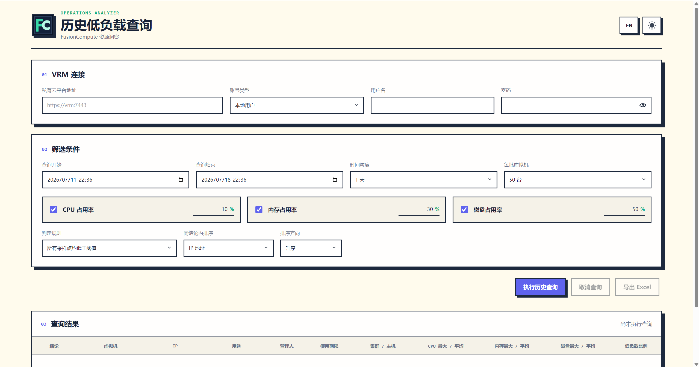

# FusionCompute 历史低负载查询

FusionCompute 历史低负载查询是一个面向 FusionCompute VRM 的轻量本地 Web 工具。它登录 VRM、发现当前账号可访问站点中的运行中虚拟机、批量读取 CPU / 内存 / 磁盘历史监控数据，并根据阈值规则生成低负载分析结果。

工具不依赖数据库、不保存性能数据，也不会持久化 VRM 用户名、密码或 Token。查询结果仅在服务进程内存中短暂保留，适合在运维终端按需启动和使用。

## 目录

- [一、项目介绍](#一项目介绍)
- [二、快速开始](#二快速开始)
- [三、使用说明](#三使用说明)
- [四、计算与判定口径](#四计算与判定口径)
- [五、FusionCompute REST 调用链](#五fusioncompute-rest-调用链)
- [六、本地 HTTP API](#六本地-http-api)
- [七、安全与数据生命周期](#七安全与数据生命周期)
- [八、注意事项](#八注意事项)
- [九、常见问题](#九常见问题)
- [十、版本历史](#十版本历史)
- [十一、许可证](#十一许可证)
- [十二、联系方式](#十二联系方式)

# 一、项目介绍

## 1.1 项目简介

本项目把 FusionCompute 历史资源使用率查询封装为一个单进程 Web 页面。运维人员在页面中输入 VRM 地址和账号信息，设置时间范围、采样粒度、资源阈值与判定规则后，即可查看每台运行中虚拟机的历史资源汇总，并导出格式化 Excel。

页面界面支持简体中文 / English、浅色 / 深色主题；排序、查询结果搜索和二次筛选均在浏览器端即时完成，不会重复向 VRM 发起监控请求。

## 1.2 项目预览



## 1.3 核心功能

- **跨站点发现**：自动读取当前账号可访问的全部站点，分页发现状态为 `running` 的虚拟机。
- **历史资源查询**：按站点和每批虚拟机数量批量查询 CPU、内存、磁盘历史曲线；前端可选 10、20、30、50 或 100 台/批，默认 100 台/批。
- **低负载判定**：支持“所有采样点均低于阈值”和“低于阈值的采样点比例”两种规则。
- **资源汇总**：输出每个指标的最大值、平均值和低于阈值的采样点比例；缺失历史数据会显式标记为“无数据”。
- **描述拆分**：按描述中的 `-` 从右向左拆分出用途、管理人、使用期限三列，兼容 `－`、`—`、`–`。
- **本地排序与筛选**：结果按结论分组，可选择同结论内排序列及方向；支持全文搜索、结论、管理人、集群、主机和三类资源指标阈值筛选。
- **格式化导出**：导出带标题、摘要、筛选、冻结表头、边框和交替底色的 Excel；导出内容与当前页面筛选后的结果一致。
- **任务控制**：展示登录、发现虚拟机、分批查询和计算进度；支持取消正在进行的查询。

## 1.4 技术栈

| 层级 | 采用方案 |
| :-: | :-: |
| 后端 | Go 1.26、Go 标准库 `net/http`、`embed` 静态资源 |
| 前端 | 原生 HTML、CSS、JavaScript，无需 Node.js 构建步骤 |
| VRM 通信 | FusionCompute REST API、`X-Auth-Token` 会话认证 |
| Excel 导出 | 浏览器端生成 `.xlsx`，包含基础表格样式 |
| 运行方式 | 单个 Go 进程 / Windows 单文件 `.exe` |

## 1.5 项目结构

```text
fc-history-query/
├── cmd/
│   └── fc-history-query/        # 程序入口、监听地址与端口参数
├── internal/
│   ├── domain/                  # 连接、虚拟机、指标、查询结果领域模型
│   ├── fusion/                  # FusionCompute REST 客户端与认证逻辑
│   ├── query/                   # 分批查询、统计计算、判定与后端排序
│   └── web/                     # 本地 HTTP API、任务状态与静态页面
│       └── static/              # 页面、样式、Excel 导出与图标资源
├── go.mod
└── README.md
```

# 二、快速开始

## 2.1 环境要求

- Go 1.18+（非源码编译无需）
- FusionCompute 8.2.0+
- 能访问目标 FusionCompute VRM 的网络环境
- 一个具有目标站点和虚拟机查看权限的 VRM 账号

## 2.2 二进制启动

从 [GitHub Releases](https://github.com/zyx3721/fc-history-query/releases) 下载与操作系统、CPU 架构相匹配的文件。发布文件名会包含系统和架构后缀，例如 `windows-amd64`、`macos-arm64` 或 `linux-amd64` 。

> Windows ARM 设备选择 `windows-arm64`；搭载 Apple Silicon 芯片的 Mac 选择 `macos-arm64`；Intel Mac 选择 `macos-amd64` 。

### 2.2.1 Windows

下载对应的 `.exe` 文件后，可直接双击运行，或在文件所在目录打开 PowerShell，执行以下命令启动：

```powershell
# 默认仅允许本机访问
.\fc-history-query-windows-amd64.exe

# 示例：监听 9090 端口并允许局域网访问
.\fc-history-query-windows-amd64.exe --host 0.0.0.0 --port 9090
```

### 2.2.2 macOS

下载对应文件后，在终端执行：

```bash
chmod +x ./fc-history-query-macos-arm64
./fc-history-query-macos-arm64
```

如果 macOS 首次阻止运行，请在“系统设置 → 隐私与安全性”中允许该程序，或在确认文件来源可信后执行：

```bash
xattr -d com.apple.quarantine ./fc-history-query-macos-arm64
```

### 2.2.3 Linux

下载对应文件后，在终端执行：

```bash
chmod +x ./fc-history-query-linux-amd64
./fc-history-query-linux-amd64
```

无论使用何种系统，服务默认监听 `127.0.0.1:8088`，浏览器访问 `http://127.0.0.1:8088`。

## 2.3 从源码启动

克隆项目仓库：

```bash
git clone https://github.com/zyx3721/fc-history-query.git
cd fc-history-query
```

### 2.3.1 Windows

```powershell
go run .\cmd\server
```

### 2.3.2 macOS

```bash
go run ./cmd/server
```

### 2.3.3 Linux

```bash
go run ./cmd/server
```

源码启动后的默认访问地址同样为 `http://127.0.0.1:8088` 。

## 2.4 Docker 启动

```bash
docker run -d --name fc-history-query --restart unless-stopped -p 8088:8088 registry.cn-shenzhen.aliyuncs.com/zyx3721/fc-history-query:latest
```

# 三、使用说明

## 3.1 VRM 连接信息

页面需要填写以下连接信息：

| 字段 | 说明 |
| :-: | :-: |
| 私有云平台地址 | VRM 根地址，例如 `https://vrm.example.com:7443`。协议、主机和端口应与实际可用的控制台 REST 请求一致。 |
| 账号类型 | `本地用户` 或 `域用户`。不同类型采用不同的密码传递方式，详见 [5.2 认证方式](#52-认证方式)。 |
| 用户名 / 密码 | 仅用于创建本次 VRM 会话。 |

## 3.2 查询条件

### 3.2.1 时间范围与粒度

- 页面默认查询最近 30 天，可自行设置开始和结束时间。
- 结束时间必须晚于开始时间；查询时间范围必须**严格大于**所选粒度；单次查询范围最长为 **366 天**。
- 页面可选粒度为 1 分钟、5 分钟、10 分钟、30 分钟、1 小时、1 天、30 天，默认 1 天。粒度越细，采样点与 VRM 响应量通常越多。

### 3.2.2 资源指标与阈值

可同时勾选 CPU、内存、磁盘占用率，每个阈值范围为 `0` 至 `100`。一台虚拟机只有在**所有已勾选指标**均满足当前判定规则时，结论才为“符合”。

未勾选的指标不会请求、计算或参与结论判定。

### 3.2.3 每批虚拟机

可选 10、20、30、50、100 台/批，默认 100 台。程序还会按站点边界分批，避免将不同站点的虚拟机放入同一个历史指标请求。

- 站点响应较慢或 VRM 负载较高时，建议使用较小批次。
- 后端校验的最大批量为 **100 台**。
- 相邻批次间固定间隔 250 ms，默认每秒最多约 4 次历史监控请求，低于相关 REST 资料中每分钟 300 次调用的建议上限。

## 3.3 判定规则

### 3.3.1 所有采样点均低于阈值

选中指标的每一个有效采样点都必须小于或等于阈值。

例如，CPU 阈值为 10%，采样值为 `4%`、`8%`、`10%`，则 CPU 指标符合；若任一采样点为 `10.1%`，则 CPU 指标不符合。

### 3.3.2 低于阈值的采样点比例

计算每项指标中“小于或等于阈值”的采样点占有效采样点总数的比例，并要求该比例大于或等于“最低比例”。

例如，CPU 阈值为 10%，共有 10 个采样点，其中 9 个不高于 10%，则低负载比例为 `90%`：

- 最低比例为 `90%`：该 CPU 指标符合；
- 最低比例为 `95%`：该 CPU 指标不符合。

## 3.4 查询结果、排序与描述拆分

结果表包含结论、虚拟机、IP、用途、管理人、使用期限、集群/主机、三类资源汇总和低负载比例。

描述按 `-` 从右侧拆分：最后一段为“使用期限”、倒数第二段为“管理人”、其余部分重新以 `-` 拼接为“用途”。

```text
web测试-张三-长期
├─ 用途：web测试
├─ 管理人：张三
└─ 使用期限：长期
```

如果描述不足三个片段，则完整描述显示在“用途”列，管理人和使用期限显示为 `-`。虚拟机名称与 URN 超出列宽时会显示省略号，鼠标悬浮可查看完整内容。

排序规则如下：

1. “符合”始终排在“不符合”之前。
2. 同一结论内按选择的字段与升序/降序排列。
3. 排序字段相同时，使用 IP 地址自然排序；仍相同时再按 URN 排序，保证显示稳定。

查询完成后修改排序列或方向，只会在浏览器中立即重排，不会重新查询 VRM。

## 3.5 查询结果搜索与筛选

结果标题下方的筛选区仅在查询完成后显示，筛选的是本次已经返回到页面的数据。

| 筛选项 | 行为 |
| :-: | :-: |
| 搜索全部内容 | 可搜索结论、虚拟机名称、URN、IP、原始描述、用途、管理人、使用期限、集群、主机和资源数值。 |
| 结论 | 筛选全部、符合或不符合。 |
| 管理人 / 集群 / 主机 | 下拉项由本次完整查询结果自动汇总，不会因当前其他筛选条件减少。 |
| CPU / 内存 / 磁盘 | 每项均可选择最大值或平均值、超过或不超过，再输入阈值。阈值留空时该项不参与筛选。 |

多个筛选条件之间为**且**关系。筛选、搜索和排序不会改变服务器端查询结果，也不会再次请求 VRM；页面会显示当前可见条数，可随时点击“重置筛选”恢复。

## 3.6 导出 Excel

点击“导出 Excel”可下载格式化 `.xlsx` 文件，包含标题、导出摘要、冻结表头、自动筛选、表头样式、边框、交替底色和适配的列宽。

- 未使用结果筛选时，导出全部查询结果。
- 使用搜索或筛选后，导出**当前可见结果**。
- 导出摘要会显示已扫描数量、符合数量和实际导出数量。

# 四、计算与判定口径

## 4.1 采样点含义

采样点是**某一台虚拟机、某一个资源指标在查询时间范围内的一个时间点数据**，不是虚拟机数量。

例如查询到 10 台虚拟机，并不代表每台指标只有 10 个采样点。采样点数量由时间范围、所选粒度以及 VRM 实际返回的数据共同决定。

## 4.2 最大值、平均值与低负载比例

对某个指标的有效数值采样点集合 `x1, x2, …, xn`：

| 项目 | 计算方式 |
| :-: | :-: |
| 最大值 | `max(x1, x2, …, xn)` |
| 平均值 | `(x1 + x2 + … + xn) / n` |
| 低负载比例 | `满足 xi ≤ 阈值 的采样点数 / n × 100%` |

无法解析、`NaN` 或无穷大的采样值会被忽略。若一个指标没有任何有效采样点，则标记为“无数据”，并导致该虚拟机在当前查询中不符合判定条件。

## 4.3 多资源指标的关系

已勾选的 CPU、内存、磁盘指标采用**且**关系：

```text
虚拟机符合 = CPU 符合 AND 内存符合 AND 磁盘符合
```

只勾选其中一项时，则只根据该项指标计算结论。

# 五、FusionCompute REST 调用链

## 5.1 调用顺序

| 顺序 | 方法与接口 | 用途 |
| :-: | :-: | :-: |
| 1 | `POST /service/session` | 登录 VRM，从响应头获取 `X-Auth-Token`。 |
| 2 | `GET /service/sites` | 获取当前账号可访问的站点 URI。 |
| 3 | `GET <site_uri>/vms?limit=100&offset=…&status=running&detail=1` | 分页读取运行中的虚拟机、描述、IP、集群和主机信息。 |
| 4 | `POST <site_uri>/monitors/objectmetric-curvedata?siteID=<site_id>` | 按站点和批次读取选中资源指标的历史曲线。 |

资源请求统一携带 `Accept: application/json;charset=UTF-8`、`Accept-Language: zh_CN` 和 `X-Auth-Token`。历史查询请求显式传递 `statisticMethod: "average"`。

## 5.2 认证方式

| 账号类型 | `X-Auth-UserType` | `X-ENCRIPT-ALGORITHM` | `X-Auth-Key` |
| :-: | :-: | :-: | :-: |
| 本地用户 | `0` | `0` | 输入密码的 SHA-256 十六进制摘要 |
| 域用户 | `1` | `1` | 输入的原始密码 |

请求还会携带 `X-Auth-User` 和 `X-Auth-AuthType: 0`。登录成功后，Token 仅用于本次查询任务的后续 VRM 请求。

## 5.3 VRM 兼容性边界

- 基础地址必须是完整的 `http://` 或 `https://` URL。
- 项目默认允许自签名 TLS 证书，以兼容常见私有云环境。
- 不同环境的 VRM 控制台与监控接口端口可能不同，应以实际能够成功调用 REST 接口的协议、主机和端口为准。
- 若当前账号没有任何可访问站点，查询会返回明确错误；若没有运行中的虚拟机，查询会正常完成但结果为空。

# 六、本地 HTTP API

页面与本地服务通过以下接口通信。这些接口只用于本机页面任务管理，不是 FusionCompute VRM 接口。

| 方法 | 路径 | 用途 |
| :-: | :-: | :-: |
| `POST` | `/api/queries` | 创建异步查询任务。请求体包含 VRM 连接、时间范围、指标、阈值、规则、批量和排序选项。 |
| `GET` | `/api/queries/{id}` | 获取任务状态、进度、结果或错误信息。 |
| `DELETE` | `/api/queries/{id}` | 取消仍在运行的任务。 |

任务状态包括 `running`、`cancelling`、`completed`、`failed`、`cancelled`。任务完成、失败或取消后，任务对象会在内存中保留 15 分钟，之后自动移除。

# 七、安全与数据生命周期

## 7.1 凭据与 Token

- 密码仅用于创建 VRM 会话；本地用户密码在生成 SHA-256 摘要后立即从后端连接对象清空。
- 查询任务结束、失败或取消时，程序会清空内存中的用户名、密码和 `X-Auth-Token`。
- 程序目前不会主动调用 VRM 的注销接口，因此 VRM 侧会话由 VRM 自身的会话超时策略回收。

## 7.2 结果与浏览器数据

- 不写入数据库、文件或浏览器本地存储的性能数据。
- 查询结果仅保存在本地服务进程内存中 15 分钟，供页面轮询和下载导出使用。
- 浏览器仅使用 `localStorage` 保存语言和主题偏好，不保存 VRM 凭据或查询结果。
- Excel 文件由用户浏览器下载，后续保存、分发与清理由使用者自行负责。

## 7.3 网络暴露与 TLS

- 默认只监听 `127.0.0.1:8088`。
- 如需局域网访问，请使用可信网络、主机防火墙、反向代理认证或其他访问控制措施。
- 允许自签名证书是兼容性选择；生产环境建议为 VRM 使用可信证书并控制网络访问范围。

# 八、注意事项

- 本工具只查询状态为 `running` 的虚拟机。
- 每个查询任务使用独立的 VRM 客户端和会话，不会复用上一次查询的 Token。
- 查询取消会取消后续处理和请求等待；已经发送到 VRM 的 HTTP 请求是否立即终止取决于网络与 VRM 响应状态。
- 批量大小越大不一定越快，受 VRM 性能、站点规模、时间范围、采样粒度和单次接口响应限制影响。
- 筛选栏中的指标条件用于二次查看已返回结果，不会修改原始低负载结论。
- 排序、搜索、筛选均是浏览器端操作；关闭页面、停止本程序或任务过期后，需要重新查询。

# 九、常见问题

## 9.1 查询后全部显示“无数据”或“不符合”

请依次检查：

1. 查询时间范围内该虚拟机是否确实存在历史监控数据。
2. 所选采样粒度是否与 VRM 控制台可查看的数据粒度一致。
3. 页面填写的基础地址、协议和端口是否与开发者工具中实际成功的 `objectmetric-curvedata` 请求一致。
4. 当前账号是否有目标站点、虚拟机和性能监控数据的读取权限。
5. VRM 返回的指标 ID、时间格式和单位是否符合当前 FusionCompute 版本的接口行为。

## 9.2 为什么一台虚拟机会有很多采样点

采样点表示时间序列上的观测值，不是虚拟机数量。时间范围越长、粒度越细，通常返回的采样点越多。

## 9.3 “低于阈值的采样点比例”如何理解

它统计的是某个资源指标所有有效采样点中，不高于阈值的比例。例如 10 个采样点中有 9 个 CPU 不高于 10%，比例就是 90%。该比例与虚拟机数量无关。

## 9.4 为什么改排序或结果筛选后没有重新查询

这是预期行为。排序、搜索和结果筛选都针对本次已完成查询的数据在浏览器端执行，因此不会重新登录 VRM 或产生新的监控 API 调用。

## 9.5 导出 Excel 是否包含筛选后的结果

是。未筛选时导出全部查询结果；使用搜索或任意结果筛选后，只导出当前可见结果。

## 9.6 端口被占用怎么办

指定一个未被占用的端口启动：

```powershell
.\fc-history-query.exe --port 9090
```

然后访问 `http://127.0.0.1:9090`。

# 十、版本历史

## 10.1 v1.0.0 - 2026-07-18

首个正式版本，提供 FusionCompute 历史低负载查询、结果筛选、Excel 导出、Docker 运行与 GitHub Release 发布能力。

详细更新内容见 [verchanglog/v1.0.0.md](verchanglog/v1.0.0.md)。

# 十一、许可证

本项目采用 MIT License，详见 [LICENSE](LICENSE)。

# 十二、联系方式

- **作者**：Jerion
- **邮箱**：416685476@qq.com
- **项目地址**：https://github.com/zyx3721/fc-history-query
